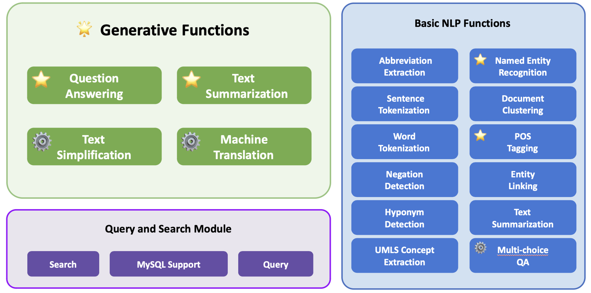

<p align="center">
   
</p>


# Ascle: A Python Natural Language Processing Toolkit for Medical Text Generation

[](https://www.python.org/downloads/release/python-360/)
[](https://www.python.org/downloads/release/python-380/)
[](https://www.python.org/downloads/release/python-380/)
[](https://www.python.org/downloads/release/python-3100/)

We introduce Ascle, a pioneering natural language processing (NLP) toolkit designed for medical text generation. Ascle is tailored for biomedical researchers and healthcare professionals with an easy-to-use, all-in-one solution that requires minimal programming expertise.  

This work,  [Ascle: A Python Natural Language Processing Toolkit for Medical Text Generation](https://arxiv.org/abs/2311.16588),  has been accepted by JMIR recently! 

### Framework of Ascle 

Ascle consists of three modules:

🌟 **Generative Functions**: For the first time, Ascle includes four advanced and challenging generative functions: question-answering, text summarization, text simplification, and machine translation; 

**Basic NLP Functions**: Ascle consists of 12 essential NLP functions such as word tokenization and sentence segmentation; 

**Query and Search Capabilities**: Ascle provides user-friendly query and search functions on clinical databases.

<p align="center">
   
</p>
<p align="center">⚙️indicates that we have our fine-tuned models for this particular task. <br> ⭐️indicates that we conducted evaluations for this particular task.</p>

## Table of Contents

* [Updates](#updates)
* [Setup](#setup)
* [Fine-tuned Models](#fine-tuned-models)
* [Get Involved](#get-involved)
* [Citation](#citation)
* [Contact](#contact)

## Updates
_29_07_2024_ - We uploaded a new folder, `Ascle-JPBench`, containing open-sourced EN-JP medical task data examples. Ascle-JPBench will support comprehensive tasks such as QA, NLI, and multiple choice. <br/>
_17_05_2024_ - We are currently updating Ascle. In the next version, Ascle will include the question-answering task based on the RAG framework and will support multiple languages for all tasks. <br/>
_07_11_2023_ - New Release v2.2: we changed the toolkit name to Ascle from EHRKit, easier to use! <br/>
_10_07_2023_ - New Release v2.0: a large re-organization and improvement from v1.0. <br/>
_24_05_2023_ - New Release Pretrained Models for Machine Translation. <br/>
_15_03_2022_ - Merged the ehrkit folder to support off-shelf medical text processing. <br/>
_10_03_2022_ - Made all tests available in an ipynb file and updated the most recent version. <br/>
_17_12_2021_ - New folder collated_tasks containing Fall 2021 functionalities added <br/>
_11_05_2021_ - cleaned up the notebooks, fixed up the readme using depth=1. <br/>
_04_05_2021_ - Tests run-through added in `tests`. <br/>
_22_04_2021_ - Freezing development. <br/>
_22_04_2021_ - Completed the tutorials and readme. <br/>
_20_04_2021_ - Spring functionality finished -- mimic classification, summarization, and query extraction. <br/>

## Setup

### Download Repository

You can download Ascle as a git repository; simply clone to your choice of directories (keep depth small to keep the old versions out and reduce size).

```
git clone https://github.com/Yale-LILY/Ascle.git
```

### Environment

```
cd Ascle
python3 -m venv asclevir/
source asclevir/bin/activate
pip install -r requirements.txt
```

NOTE: there is a chance that your Python version is not compatible with scispacy, so you can install with the following command:
```
pip install scispacy
pip install https://s3-us-west-2.amazonaws.com/ai2-s2-scispacy/releases/v0.5.0/en_core_sci_sm-0.5.0.tar.gz
```
Then you are good to go!

### Ascle Demo
We provide various generative functions and basic NLP functions. A quick start is to run the demo.py:

```
cd Ascle
python demo.py
```
Note: this may take some time, as some packages will be downloaded. 

#### Load Ascle
```python
from Ascle import Ascle

# create Ascle 
med = Ascle()
```

#### Text Simplification
```python
# Text Simplification
main_record = """
              The patient presents with symptoms of acute bronchitis,
              including cough, chest congestion, and mild fever.
              Auscultation reveals coarse breath sounds and occasional 
              wheezing. Based on the clinical examination, a diagnosis
              of acute bronchitis is made, and the patient is prescribed 
              a short course of bronchodilators and advised to rest and
              stay hydrated.
              """

# choose the model
layman_model = "ireneli1024/bart-large-elife-finetuned"

med.update_and_delete_main_record(main_record)

# call the text simplification function and print the output
print(med.get_layman_text(layman_model, min_length=20, max_length=70))

>> """
   The patient presents with symptoms of acute bronchitis including
   cough, chest congestion and mild fever. Auscultation reveals coarse 
   breath sounds and occasional wheezing. Based on these symptoms and 
   the patient's history of previous infections with the same condition, 
   the doctor decides that the patient is likely to have a cold or bronch.
   """
```

#### Machine Translation
```python
main_record = """
              Myeloid derived suppressor cells (MDSC) are immature myeloid 
              cells with immunosuppressive activity. They accumulate in 
              tumor-bearing mice and humans with different types of cancer, 
              including hepatocellular carcinoma (HCC).
              """
              
med.update_and_delete_main_record(main_record)

# call the machine translation function and print the output
print(med.get_translation_mt5("French"))

>> """
   Les cellules suppressives dérivées de myéloïdes (MDSC) sont des
   cellules myéloïdes immatures ayant une activité immunosuppressive, 
   accumulées chez des souris et des humains ayant différents types de 
   cancer, y compris le carcinome hépatocellulaire (HCC).
   """
```

## Fine-tuned Models
In Ascle, users can access any publicly available language model. Additionally, we provide users with 32 of our fine-tuned models which are suitable for multiple-choice QA, text simplification, and machine translation tasks.

Please feel to download our fine-tuned models: 

| Tasks                | Base Model      | Fine-Tuned Data       | Huggingface Link |
|----------------------|-----------------|-----------------------|----------|
| Multi-choice QA      | BioBERT         | HEADQA                | [Download](https://huggingface.co/li-lab/ascle-BioBERT-finetune-HEADQA) |
|                      | ClinicalBERT    | HEADQA                | [Download](https://huggingface.co/li-lab/ascle-ClinicalBERT-finetune-HEADQA) |
|                      | SapBERT         | HEADQA                | [Download](https://huggingface.co/li-lab/ascle-SapBERT-finetune-HEADQA) |
|                      | PubMedBERT      | HEADQA                | [Download](https://huggingface.co/li-lab/ascle-PubMedBERT-finetune-HEADQA) |
|                      | GatorTron       | HEADQA                | [Download](https://huggingface.co/li-lab/ascle-GatorTron-finetune-HEADQA) |
|                      | BioBERT         | MedMCQA-w-context     | [Download](https://huggingface.co/li-lab/ascle-BioBERT-finetune-MedMCQA-w-context) |
|                      | ClinicalBERT    | MedMCQA-w-context     | [Download](https://huggingface.co/li-lab/ascle-ClinicalBERT-finetune-MedMCQA-w-context) |
|                      | SapBERT         | MedMCQA-w-context     | [Download](https://huggingface.co/li-lab/ascle-SapBERT-finetune-MedMCQA-w-context) |
|                      | PubMedBERT      | MedMCQA-w-context     | [Download](https://huggingface.co/li-lab/ascle-PubMedBERT-finetune-MedMCQA-w-context) |
|                      | GatorTron       | MedMCQA-w-context     | [Download](https://huggingface.co/li-lab/ascle-GatorTron-finetune-MedMCQA-w-context) |
|                      | BioBERT         | MedMCQA-wo-context    | [Download](https://huggingface.co/li-lab/ascle-BioBERT-finetune-MedMCQA-wo-context) |
|                      | ClinicalBERT    | MedMCQA-wo-context    | [Download](https://huggingface.co/li-lab/ascle-ClinicalBERT-finetune-MedMCQA-wo-context) |
|                      | SapBERT         | MedMCQA-wo-context    | [Download](https://huggingface.co/li-lab/ascle-SapBERT-finetune-MedMCQA-wo-context) |
|                      | PubMedBERT      | MedMCQA-wo-context    | [Download](https://huggingface.co/li-lab/ascle-PubMedBERT-finetune-MedMCQA-wo-context) |
|                      | GatorTron       | MedMCQA-wo-context    | [Download](https://huggingface.co/li-lab/ascle-GatorTron-finetune-MedMCQA-wo-context) |
| Text Simplification  | BART            | eLife                 | [Download](https://huggingface.co/li-lab/ascle-bart-large-elife-finetuned) |
|                      | BioBART         | eLife                 | [Download](https://huggingface.co/li-lab/ascle-biobart-v2-base-elife-finetuned) |
|                      | BigBirdPegasus  | eLife                 | [Download](https://huggingface.co/li-lab/ascle-bigbird-pegasus-large-pubmed-elife-finetuned) |
|                      | BART            | PLOS                  | [Download](https://huggingface.co/li-lab/ascle-bart-large-PLOS-finetuned) |
|                      | BioBART         | PLOS                  | [Download](https://huggingface.co/li-lab/ascle-biobart-v2-base-plos-finetuned) |
|                      | BigBirdPegasus  | PLOS                  | [Download](https://huggingface.co/li-lab/ascle-bigbird-pegasus-large-pubmed-plos-finetuned) |
| Machine Translation  | mT5             | UFAL (en_es)          | [Download](https://huggingface.co/li-lab/ascle-en-es-UFAL-medical) |
|                      | mT5             | UFAL (en_fr)          | [Download](https://huggingface.co/li-lab/ascle-en-fr-UFAL-medical) |
|                      | mT5             | UFAL (en_ro)          | [Download](https://huggingface.co/li-lab/ascle-en-ro-UFAL-medical) |
|                      | mT5             | UFAL (en_cs)          | [Download](https://huggingface.co/li-lab/ascle-en-cs-UFAL-medical) |
|                      | mT5             | UFAL (en_de)          | [Download](https://huggingface.co/li-lab/ascle-en-de-UFAL-medical) |
|                      | mT5             | UFAL (en_hu)          | [Download](https://huggingface.co/li-lab/ascle-en-hu-UFAL-medical) |
|                      | mT5             | UFAL (en_pl)          | [Download](https://huggingface.co/li-lab/ascle-en-pl-UFAL-medical) |
|                      | mT5             | UFAL (en_sv)          | [Download](https://huggingface.co/li-lab/ascle-en-sv-UFAL-medical) |
|                      | MarianMT        | UFAL (en_es)          | [Download](https://huggingface.co/li-lab/ascle-en-es-UFAL-MarianMT) |
|                      | MarianMT        | UFAL (en_fr)          | [Download](https://huggingface.co/li-lab/ascle-en-fr-UFAL-MarianMT) |
|                      | MarianMT        | UFAL (en_ro)          | [Download](https://huggingface.co/li-lab/ascle-en-ro-UFAL-MarianMT) |


## Get involved

Please create a GitHub issue if you have any questions, suggestions, requests or bug-reports. We welcome PRs!


## Acknowledgement 
This project started at the year of 2018. There are many people participated and made contributions:

Rui Yang*, Qingcheng Zeng*, Keen You*, Yujie Qiao*, Lucas Huang, Chia-Chun Hsieh, Benjamin Rosand, Jeremy Goldwasser, Amisha D Dave, Tiarnan D.L. Keenan, Emily Y Chew, Dragomir Radev, Zhiyong Lu, Hua Xu, Qingyu Chen, Irene Li


Our sincere gratitude also goes to Dr.Edison Marrese-Taylor and Prof. Yutaka Matsuo from the University of Tokyo, for their invaluable guidance and support throughout this project.

🕯️ Especially in the memory of Prof. Dragomir Radev, who has dedicated so much to this project.

## Paper
Please find our paper at https://arxiv.org/abs/2311.16588.

## Citation
```bibtext
@misc{yang2023ascle,
      title={Ascle: A Python Natural Language Processing Toolkit for Medical Text Generation}, 
      author={Rui Yang and Qingcheng Zeng and Keen You and Yujie Qiao and Lucas Huang and Chia-Chun Hsieh and Benjamin Rosand and Jeremy Goldwasser and Amisha D Dave and Tiarnan D. L. Keenan and Emily Y Chew and Dragomir Radev and Zhiyong Lu and Hua Xu and Qingyu Chen and Irene Li},
      year={2023},
      doi={10.2196/60601},
      eprint={2311.16588},
      archivePrefix={arXiv},
      primaryClass={cs.CL}
}
```

## Contact
We will continue to maintain and update this repository. If you have any questions, feel free to contact us. <br/>
Rui Yang: yang_rui@u.nus.edu
Dr. Irene Li: ireneli@ds.itc.u-tokyo.ac.jp <br/>

