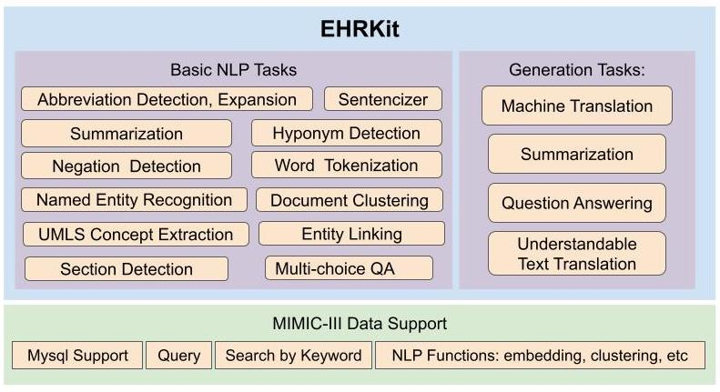

<p align="center">
   
</p>


# EHRKit: A Python Natural Language Processing Toolkit for Electronic Health Record Texts

[](https://www.python.org/downloads/release/python-360/)
[](https://www.python.org/downloads/release/python-380/)

This library aims at processing medical texts in electronic health records. We provide specific functions to access the [MIMIC-III](https://physionet.org/content/mimiciii-demo/) record efficiently; the method includes searching by record ID, searching similar records, searching with an input query. We also support functions for some NLP tasks, including abbreviation disambiguation, extractive and abstractive summarization. For more specific evaluaiton, please check this [pre-print](https://arxiv.org/abs/2204.06604).

Moreover, if users want to deal with general medical texts, we integrate third-party libraries, including [hugginface](https://huggingface.co/), [scispacy](https://allenai.github.io/scispacy/), [allennlp](https://github.com/allenai/allennlp), [stanza](https://stanfordnlp.github.io/stanza/), and so on. Please checkout the special verison of this library, [EHRKit-WF](https://github.com/Yale-LILY/EHRKit/tree/master/wrapper_functions).


### File Organization

- EHRKit
  - mimiciii: main mimic-iii support
  - wrapper_functions: main off-shelf function support
  - independent_tasks: individual tasks and functions with tutorials
    - collated tasks
    - QueryExtraction
    - extractiveSummarization
    - mimic_icd9_coding
    - pubmed
    - tutorials


<p align="center">
   
</p>

## Table of Contents

1. [Updates](#updates)
2. [Data](#data)
3. [Setup](#setup)
4. [Toolkit](#toolkit)
5. [Get Involved](#get-involved)
6. [Off-shelf Functions](#get-involved)
<!-- 6. [Citation](#get-involved) -->


## Updates
_10_07_2023_ - New Release v2.0: a large re-organization and improvement from v1.0. <br/>
_24_05_2023_ - New Release Pretrained Models for Machine Translation. <br/>
_15_03_2022_ - Merged a wrapper function folder to support off-shelf medical text processing. <br/>
_10_03_2022_ - Made all tests avaiable in a ipynb file and updated the most recent version. <br/>
_12_17_2021_ - New folder collated_tasks containing Fall 2021 functionalities added <br/>
_05_11_2021_ - cleaned up the notebooks, fixed up the readme using depth=1 <br/>
_05_04_2021_ - Tests run-through added in `tests` <br/>
_04_22_2021_ - Freezing development <br/>
_04_22_2021_ - Completed the tutorials and readme. <br/>
_04_20_2021_ - Spring functionality finished -- mimic classification, summarization, and query extraction <br/>

## Data
EHRKit is built for use with Medical Information Mart for Intensive Care-III (MIMIC-III). It requires this dataset to be downloaded. This dataset is freely available to the public, but it requires completion of an online training course. Information on accessing MIMIC-III can be found at https://mimic.physionet.org/gettingstarted/access. Once this process is complete, it is recommended to download the mimic files to the folder `data/`

The other dataset that is required for some of the modules is the [pubmed dataset](https://www.ncbi.nlm.nih.gov/CBBresearch/Wilbur/IRET/DATASET/), this dataset contains a large number of medical articles. The required downloading and parsing is all performed in the `pubmed/` folder. First run `bash download_pubmed.sh` and then `python parse_articles.py`. This process is also detailed in the tutorial notebook for summarization: `tutorials/naiveBayes.ipynb`

## Setup

### Download Repository

You can download EHRKit as a git repository, simply clone to your choice of directories (keep depth small to keep the old versions out and reduce size)
```
git clone https://github.com/Yale-LILY/EHRKit.git
```

#### Environment

```
cd EHRKit
python3 -m venv ehrvir/
source ehrvir/bin/activate
pip install -r requirements.txt
```
Then you are good to go!

Not that this would work for basic mimic and wrapper functions, for the functions in `independent_tasks`, please check the corresponding README.


#### MIMIC
EHRKit requires Medical Information Mart for Intensive Care-III (MIMIC-III) database to be installed. This database is freely available to the public, but it requires completion of an online training course. Information on accessing MIMIC-III can be found at https://mimic.physionet.org/gettingstarted/access.

Once you have gotten access, you can put the mimic data as required in mimic [README](mimic/README.md), and setup mysql username and password.

A quick start is to run the demo.py:
```bash
cd mimic
python demo.py
```

#### wrapper_functions
We provide a various functions, some of them rely on third-parth libraries; we also provide our fine-tuned models too. 
Please check the [README](wrapper_functions/README.md).
A quick start is to run the demo.py:
```bash
cd wrapper_functions
python demo.py
```

## Get involved

Please create a GitHub issue if you have any questions, suggestions, requests or bug-reports. We welcome PRs!


## Contributors
Update later.
