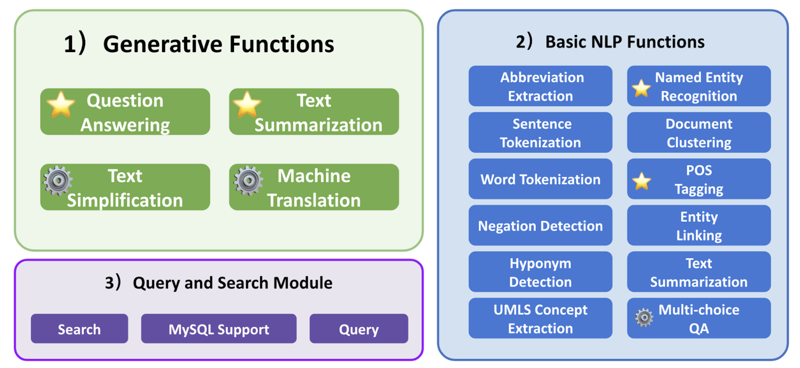

<p align="center">
   
</p>


# MedGen: A Python Natural Language Processing Toolkit for Medical Text Processing

[](https://www.python.org/downloads/release/python-360/)
[](https://www.python.org/downloads/release/python-380/)
[](https://www.python.org/downloads/release/python-380/)

We introduce MedGen, a comprehensive natural language processing (NLP) toolkit designed specifically for medical text processing. MedGen is tailored for biomedical researchers and healthcare professionals, providing them with an easy-to-use, all-in-one solution that requires minimal programming expertise. 

### Framework of MedGen 
(1) Generative Functions: For the first time, MedGen includes four advanced and challenging  generative functions: question answering, text summarization, text simplification, and machine translation; 

(2) Basic NLP Functions: MedGen consists of 12 essential NLP functions such as word tokenization and sentence segmentation; 

(3) Query and Search Capabilities: MedGen provides user-friendly query and search functions on text corpora.

<p align="center">
   
</p>
<p align="center">⚙️indicates that we have our fine-tuned models for this particular task. <br> ⭐️indicates that we conducted evaluations for this particular task.</p>

## Table of Contents

* [Updates](#updates)
* [Setup](#setup)
* [Fine-tuned Models](#fine-tuned-models)
* [Get Involved](#get-involved)
* [Citation](#citation)
* [Contact](#contact)

## Updates
_28_10_2023_ - New Release v2.1: we changed the toolkit name to MedGen from EHRKit, easier to use! <br/>
_10_07_2023_ - New Release v2.0: a large re-organization and improvement from v1.0. <br/>
_24_05_2023_ - New Release Pretrained Models for Machine Translation. <br/>
_15_03_2022_ - Merged the ehrkit folder to support off-shelf medical text processing. <br/>
_10_03_2022_ - Made all tests available in an ipynb file and updated the most recent version. <br/>
_17_12_2021_ - New folder collated_tasks containing Fall 2021 functionalities added <br/>
_11_05_2021_ - cleaned up the notebooks, fixed up the readme using depth=1. <br/>
_04_05_2021_ - Tests run-through added in `tests`. <br/>
_22_04_2021_ - Freezing development. <br/>
_22_04_2021_ - Completed the tutorials and readme. <br/>
_20_04_2021_ - Spring functionality finished -- mimic classification, summarization, and query extraction. <br/>

## Setup

### Download Repository

You can download MedGeb as a git repository; simply clone to your choice of directories (keep depth small to keep the old versions out and reduce size).

```
git clone https://github.com/Yale-LILY/MedGen.git
```

### Environment

```
cd MedGen
python3 -m venv medgenvir/
source medgenvir/bin/activate
pip install -r requirements.txt
```

NOTE: there is a chance that your Python version is not compatible with scispacy, so you can install with the following command:
```
pip install scispacy
pip install https://s3-us-west-2.amazonaws.com/ai2-s2-scispacy/releases/v0.5.0/en_core_sci_sm-0.5.0.tar.gz
```
Then you are good to go!

### MedGen Demo
We provide various generative functions and basic NLP functions. A quick start is to run the demo.py:

```
cd MedGen
python demo.py
```
Note: this may take some time, as some packages will be downloaded. 

#### Text Simplification
```python
from MedGen import MedGen

# create MedGen 
med = MedGen()

# Text Simplification
main_record = """
              The patient presents with symptoms of acute bronchitis,
              including cough, chest congestion, and mild fever.
              Auscultation reveals coarse breath sounds and occasional 
              wheezing. Based on the clinical examination, a diagnosis
              of acute bronchitis is made, and the patient is prescribed 
              a short course of bronchodilators and advised to rest and
              stay hydrated.
              """

# choose the model
layman_model = "ireneli1024/bart-large-elife-finetuned"

med.update_and_delete_main_record(main_record)

# call the text simplification function and print the output
print(med.get_layman_text(layman_model, min_length=20, max_length=70))

>> """
   The patient presents with symptoms of acute bronchitis including
   cough, chest congestion and mild fever. Auscultation reveals coarse 
   breath sounds and occasional wheezing. Based on these symptoms and 
   the patient's history of previous infections with the same condition, 
   the doctor decides that the patient is likely to have a cold or bronch.
   """
```

#### Machine Translation
```python
main_record = """
              Myeloid derived suppressor cells (MDSC) are immature myeloid 
              cells with immunosuppressive activity. They accumulate in 
              tumor-bearing mice and humans with different types of cancer, 
              including hepatocellular carcinoma (HCC).
              """
              
med.update_and_delete_main_record(main_record)

# call the machine translation function and print the output
print(med.get_translation_mt5("French"))

>> """
   Les cellules suppressives dérivées de myéloïdes (MDSC) sont des
   cellules myéloïdes immatures ayant une activité immunosuppressive, 
   accumulées chez des souris et des humains ayant différents types de 
   cancer, y compris le carcinome hépatocellulaire (HCC).
   """
```

## Fine-tuned Models
In MedGen, users can access any publicly available language model. Additionally, we provide users with 32 of our fine-tuned models which are suitable for multiple-choice QA, text simplification, and machine translation tasks.

Plase feel to download our fine-tuned models: 
* [Multi-choice QA](https://huggingface.co/RUI525) 
* [Text Simplification](https://huggingface.co/ireneli1024)
* [Machine Translation (mT5)](https://huggingface.co/qcz)
* [Machine Translation (MarianMT)](https://huggingface.co/irenelizihui)


## Get involved

Please create a GitHub issue if you have any questions, suggestions, requests or bug-reports. We welcome PRs!


## Contributors
This project started at the year of 2018. There are many people participated and made contributions:

Rui Yang*, Qingcheng Zeng*, Keen You*, Yujie Qiao*, Lucas Huang, Chia-Chun Hsieh, Benjamin Rosand, Jeremy Goldwasser,  <pr> Amisha D Dave, Tiarnan D.L. Keenan, 
Dragomir Radev, Zhiyong Lu, Qingyu Chen, Irene Li

Especially in the memory of Prof. Dragomir Radev, who has dedicated so much to this project.

## Citation
```bibtext
@misc{li2023ehrkit,
      title={EHRKit: A Python Natural Language Processing Toolkit for Electronic Health Record Texts}, 
      author={Irene Li and Keen You and Yujie Qiao and Lucas Huang and Chia-Chun Hsieh and Benjamin Rosand and Jeremy Goldwasser and Dragomir Radev},
      year={2023},
      eprint={2204.06604},
      archivePrefix={arXiv},
      primaryClass={cs.CL}
}
```

## Contact
We will continue to maintain and update this repository. If you have any questions, feel free to contact us. <br/>
Rui Yang: yang_rui@u.nus.edu
Dr. Irene Li: ireneli@ds.itc.u-tokyo.ac.jp <br/>

